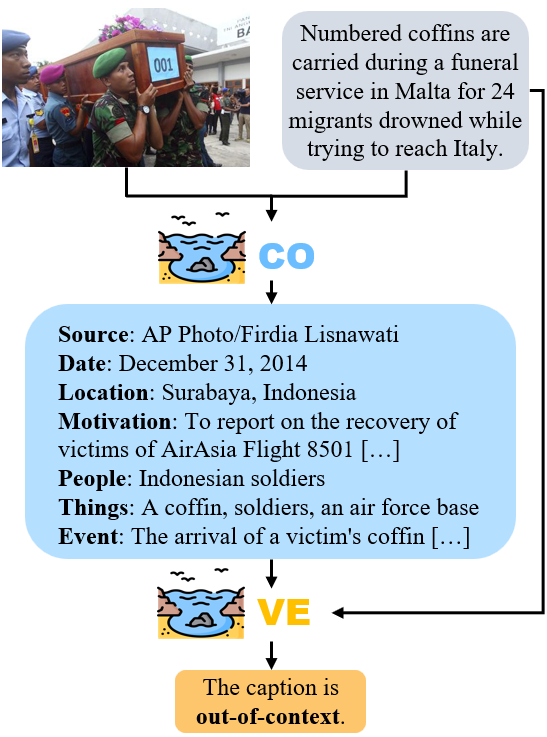
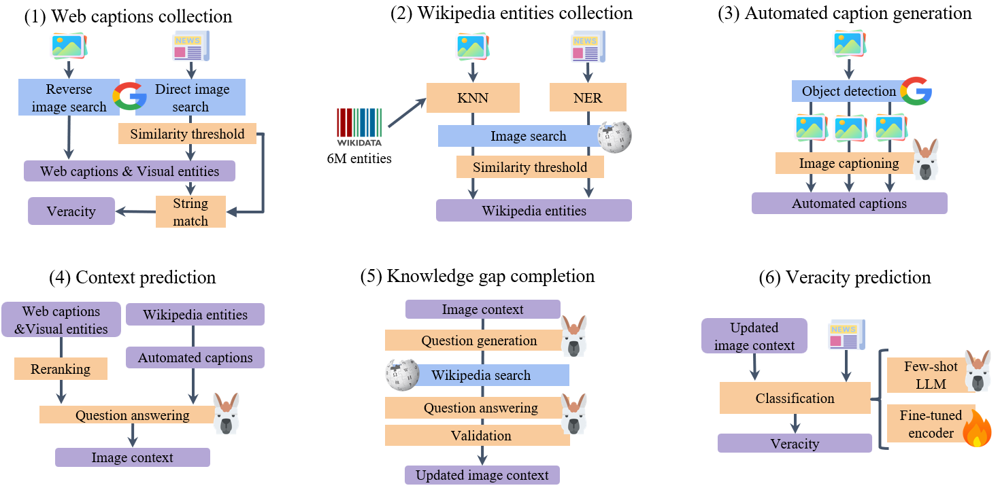

# COVE: COntext and VEracity prediction for out-of-context images

[](https://opensource.org/licenses/Apache-2.0)
[](https://www.python.org/)

This repository contains the implementation of COVE, introduced in the NAACL 2024 paper: ["COVE: COntext and VEracity prediction for out-of-context images](add_url). The code is released under an **Apache 2.0** license.

Contact person: [Jonathan Tonglet](mailto:jonathan.tonglet@tu-darmstadt.de) 

[UKP Lab](https://www.ukp.tu-darmstadt.de/) | [TU Darmstadt](https://www.tu-darmstadt.de/)

Don't hesitate to send us an e-mail or report an issue, if something is broken (and it shouldn't be) or if you have further questions. 

## News 📢

- Our paper is accepted to NAACL 2024 Main Conference! See you in Albuquerque 🌵

## Abstract 
> Images taken out of their context are the most prevalent form of multimodal misinformation. Debunking them requires  (1) providing the true context of the image and (2) checking the veracity of the image's caption. However, existing automated fact-checking methods fail to tackle both objectives explicitly. In this work, we introduce COVE, a new method that predicts first the true COntext of the image and then uses it to predict the VEracity of the caption. COVE beats the  SOTA context prediction model on all context items, often by more than five percentage points. It is competitive with the best veracity prediction models on synthetic data and outperforms them on real-world data, showing that it is beneficial to combine the two tasks sequentially. Finally, we conduct a human study that reveals that the predicted context is a reusable and interpretable artifact to verify new out-of-context captions for the same image.

<p align="center">
  
</p>


## Environment

Follow these instructions to recreate the environment used for all our experiments.

```
$ conda create --name COVE python=3.9
$ conda activate COVE
$ pip install -r requirements.txt
$ python -m spacy download en_core_web_lg
```


## Usage - prepare datasets

### NewsCLIPpings

- Follow the instructions on the NewsCLIPpings [repo](https://github.com/g-luo/news_clippings) to download the dataset. Place the data under a data/newsclippings/ folder

- Follow the instructions on the CCN [repo](https://github.com/S-Abdelnabi/OoC-multi-modal-fc) to download the reverse image search and direct search evidence. Place the reverse image search results under a data/newsclippings/evidence/reverse_image_search/ folder and place the direct search results under a data/newsclippings/evidence/direct_search/ folder

- Finally, run the following script to prepare the data
```
$ python scripts/prepare_newsclippings.py 
```


### 5Pils-OOC

- Follow the instructions on the 5Pils [repo](https://github.com/UKPLab/5pils) to download the images of 5Pils. Place the images under data/5pils-ooc/processed_img/


## Getting started - COntext and Veracity prediction for 5Pils-OOC

<p align="center">
  
</p>

COVE consist of 6 steps, the first 3 focusing on the collection of a diverse set of evidence using the Google Vision API, an index of Wikipedia entities, and captions generated by the MLLM LlavaNext. 

The results of the first 3 steps for the 5Pils-OOC dataset is stored in results/intermediate/context_input_5pils_ooc_test.csv.
If you want to run  (parts of) the 3 evidence collection steps, on 5Pils-OOC, NewsCLIPpings, or on your own data, please refer to **evidence_collection** in the scripts folder.

Step 4: context prediction

```
$ python scripts/context_llama3.py --dataset 5pils_ooc --split test 
```

Step 5: Knowledge gap completion

```
$ python scripts/knowledge_gap_completion.py --dataset 5pils_ooc --split test 
```

Step 6: veracity prediction

```
$ python scripts/veracity_llama3.py --dataset 5pils_ooc --split test 
```

Finally, evaluate the performance on context and veracity prediction.

```
$ python scripts/evaluate.py --results_file 5pils_ooc_test.csv
```
 
Evaluation of Location requires 🌍 [GeoNames](https://www.geonames.org/). You will need to create a (free) account and provide your account name as input.


### Google Vision API and Azure OpenAI service

- COVE relies on object detection using the [Google Vision API](https://cloud.google.com/vision/docs/detecting-web). This step requires a Google Cloud account.

## Citation

If you find this work relevant to your research or use this code in your work, please cite our paper as follows:

```bibtex 
@inproceedings{tonglet-etal-2024-image,
    title = "{COVE: COntext and VEracity prediction for out-of-context images",
    author = "Tonglet, Jonathan  and
      Thiem, Gabriel,  and
      Gurevych, Iryna"
}
```

## Disclaimer

> This repository contains experimental software and is published for the sole purpose of giving additional background details on the respective publication.